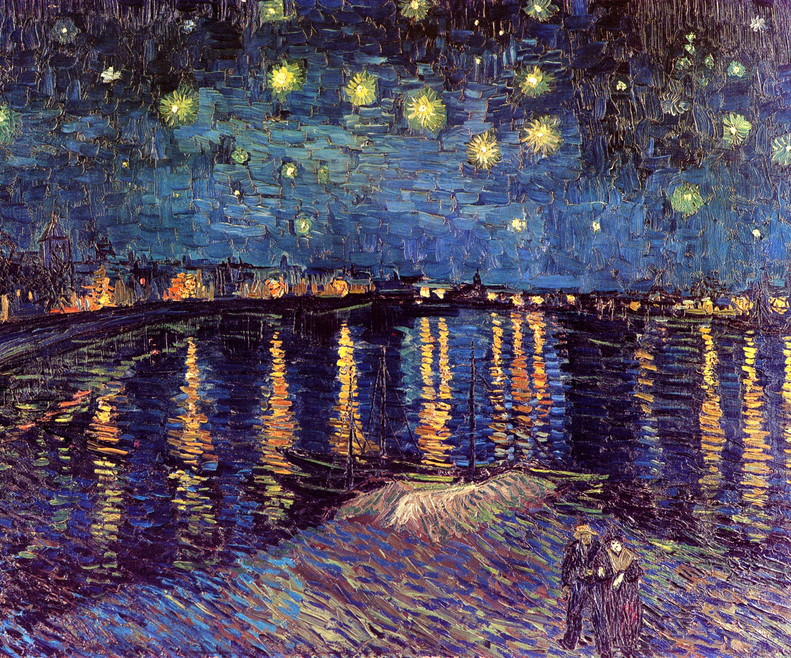
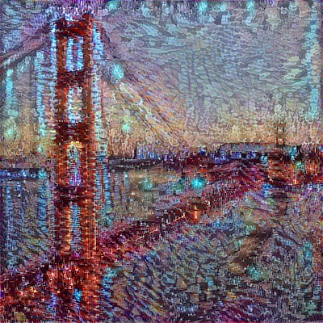
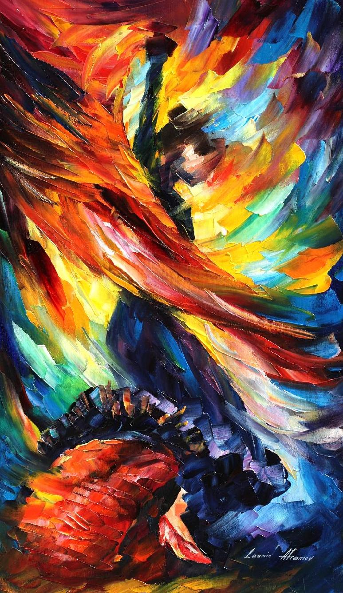
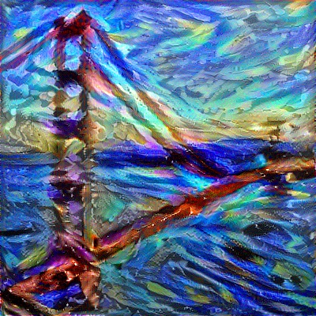
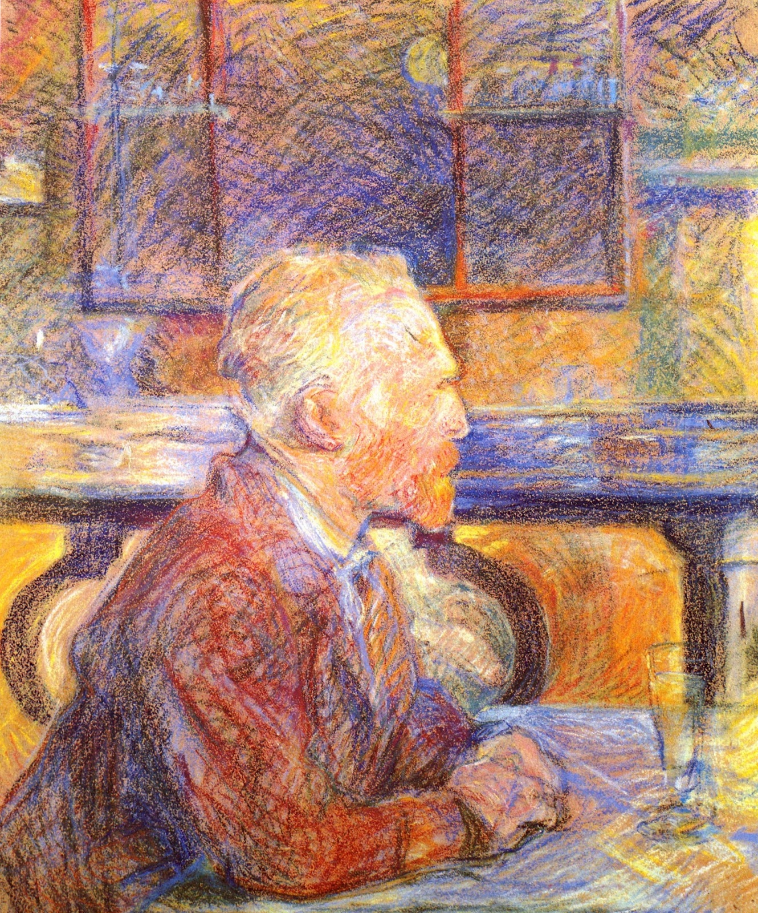
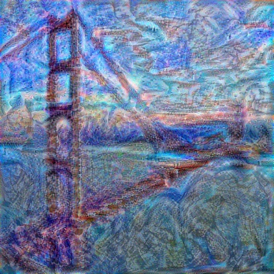

# Neural Style Transfer
My implementation of Neural Style Transfer (Gatys et al.) using TensorFlow and GPU Acceleration.
  

  Recreate an image (left: Golden Gate Bridge) in the artistic style of another image (right: Beautiful Dance by Leonid Afremov) 

  
Computes an image using the content of one image and the style of another based on reaseach conducted by [Gatys et al.](https://arxiv.org/abs/1508.06576).

Starts by initializing an Nvidia GPU TensorFlow session using [CUDA](https://developer.nvidia.com/cuda-zone) to significantly accelerate the learning. If no GPU is detected, it defaults to just using the CPU.

Then it loads two images. The first will be used as the content and the second as the style to be transferred. The images are loaded using [OpenCV](https://opencv.org/), which also reshapes and normalizes the image matrices to simplify computations. A noisy template is created using a Gaussian Filter applied to one of the images. This is the base of the resulting image.

The [VGG-19 Convolutional Neural network](https://arxiv.org/abs/1409.1556) was recreated in TensorFlow, without the top Fully-Connected Layers since I want to modify an image, not classify it. Thanks to the [MatConvNet Team](https://www.vlfeat.org/matconvnet/pretrained/), training the large VGG-19 was expedited by using their downloadable parameters pre-trained on a large training set from [ImageNet](http://www.image-net.org/).

The two normalized images are both forward propagated through the VGG-19 to compute their respective regression losses with respect to the noisy base image. However, since we're only interested in certain features of each image, they are only forward propagated through select layers.

Since earlier layers extract more concrete features (closer to original pixel value), the content image is propagated through an early layer(s). Meanwhile, the style image is propagated through a series of deeper layers to extract the more abstract stylistic features (in multiple frames of reference). The two resulting costs are then combined and optionally denoised (total variation).

Finally, the base noisy image is propagated through the entire VGG-19 with the total cost and Adam Optimization for a number of iterations to produce a style transferred image.

It's important to note that results can vary wildly based on a lot of configurable model and optimization hyperparameters including content and style layers and weights.

  
## Examples

#### Starry Night Over the Rhone by Vincent van Gogh
  

#### Beautiful Dance by Leonid Afremov
  

#### Self Portrait of Vincent Van Gogh
  
